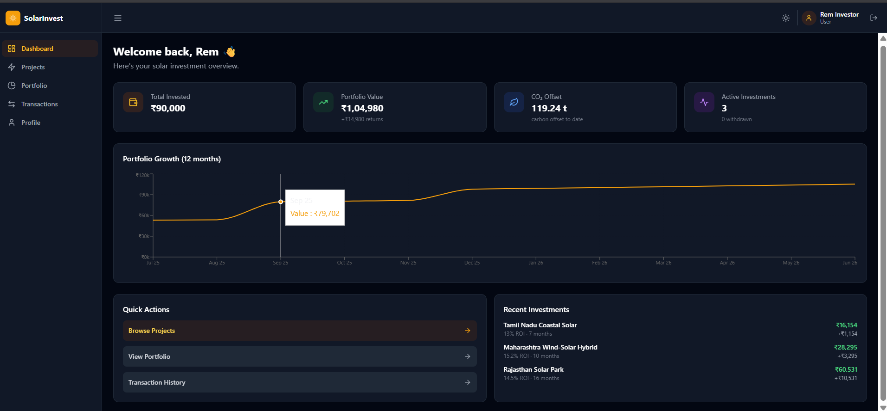
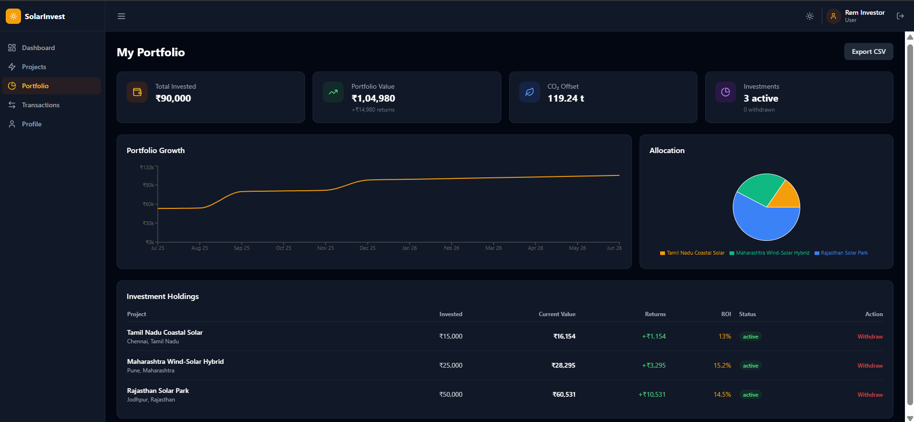
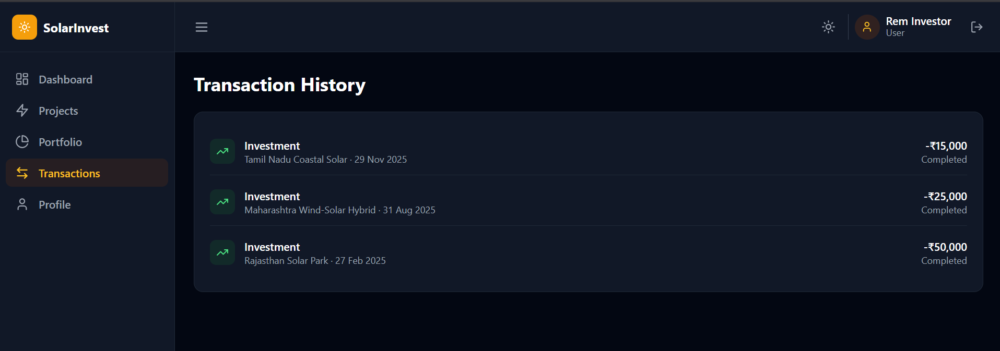
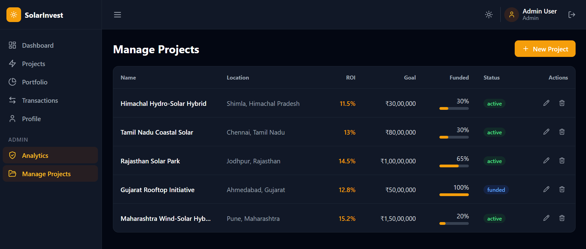

<div align="center">

# ☀️ SolarInvest

### A Full-Stack Solar Energy Investment Platform

Invest in renewable energy projects, track portfolio growth, monitor returns, and manage investments through a secure MERN Stack application.


</div>

---

# 📖 Overview

SolarInvest is a full-stack investment platform built using the MERN stack that allows users to invest in renewable solar energy projects.

The platform provides secure authentication, portfolio management, investment tracking, transaction history, compound ROI calculation, and an admin dashboard for managing projects and monitoring platform analytics.

The application follows a layered backend architecture (Controller → Service → Repository → Model) making it scalable and maintainable.

---

# 🚀 Features

### 👤 Authentication

- JWT Authentication
- HTTP-only Cookie Sessions
- Role-based Access Control
- Password Encryption using bcrypt
- Forgot Password
- Reset Password
- Change Password
- Login Attempt Lock

---

### 🌞 Investment Platform

- Browse Solar Projects
- Invest in Projects
- Compound ROI Calculation
- Portfolio Tracking
- Monthly Growth
- Total Returns
- CO₂ Savings Tracking

---

### 💳 Transactions

- Investment History
- Withdrawal Records
- Ledger System
- CSV Export

---

### 👑 Admin Features

- Admin Dashboard
- Project Management
- Platform Analytics
- User Monitoring
- Investment Statistics

---

### 🔐 Security

- Helmet Security
- CORS Protection
- JWT Authentication
- Password Hashing
- Rate Limiting
- Secure Cookies
- Audit Logs

---

# 🛠 Tech Stack

## Frontend

- React.js
- Vite
- React Router
- Axios
- Chart.js
- CSS

---

## Backend

- Node.js
- Express.js
- MongoDB
- Mongoose
- JWT
- bcrypt
- Cookie Parser

---

## Database

MongoDB Atlas

---

## Deployment

Frontend → Vercel

Backend → Render

Database → MongoDB Atlas

---

# 📸 Project Screenshots

## 📊 Investor Dashboard



---

## 💼 Portfolio



---

## 💳 Transactions



---

## 👑 Admin Dashboard



---

# 📂 Project Structure

```
SolarInvest
│
├── backend
│   ├── config
│   ├── controllers
│   ├── middleware
│   ├── models
│   ├── repositories
│   ├── routes
│   ├── services
│   ├── scripts
│   ├── utils
│   └── server.js
│
├── frontend
│   ├── src
│   ├── public
│   └── vite.config.js
│
├── screenshots
│
└── README.md
```

---

# 🏗 Backend Architecture

```
Routes
   │
Controllers
   │
Services
   │
Repositories
   │
MongoDB Models
```

The layered architecture keeps business logic separated from controllers and database operations, making the application easier to maintain and scale.

---

# 🔑 Demo Credentials

## Admin

Email

```
admin@solarinvest.com
```

Password

```
Admin@123
```

---

## Investor

Email

```
investor@solarinvest.com
```

Password

```
Demo@123
```

---

# ⚙️ Installation

## Clone Repository

```bash
git clone https://github.com/ali9667/solarinvest.git
cd solarinvest
```

---

## Backend Setup

```bash
cd backend
npm install
```

Create a `.env` file inside the `backend` directory and add:

```env
PORT=5000

MONGO_URI=your_mongodb_connection_string

JWT_SECRET=your_jwt_secret

CLIENT_URL=http://localhost:5173

NODE_ENV=development
```

Run the backend:

```bash
npm run dev
```

---

## Frontend Setup

```bash
cd frontend
npm install
npm run dev
```

Frontend will start on:

```
http://localhost:5173
```

Backend API:

```
http://localhost:5000
```

---

# 🌐 Environment Variables

## Backend

| Variable   | Description                       |
| ---------- | --------------------------------- |
| PORT       | Backend Port                      |
| MONGO_URI  | MongoDB Atlas Connection String   |
| JWT_SECRET | Secret Key for JWT Authentication |
| CLIENT_URL | Frontend URL                      |
| NODE_ENV   | development / production          |

---

# 📡 API Overview

## Authentication

```
POST /api/auth/register
POST /api/auth/login
POST /api/auth/logout
GET  /api/auth/me
PUT  /api/auth/profile
PUT  /api/auth/change-password
POST /api/auth/forgot-password
POST /api/auth/reset-password
```

---

## Projects

```
GET    /api/projects
GET    /api/projects/:id
POST   /api/projects
PUT    /api/projects/:id
DELETE /api/projects/:id
```

---

## Investments

```
POST /api/investments
GET  /api/investments/portfolio
GET  /api/investments/transactions
POST /api/investments/:id/withdraw
GET  /api/investments/export/csv
```

---

## Admin

```
GET /api/admin/analytics
```

---

# 💾 Database Collections

The application uses MongoDB Atlas with the following collections:

- Users
- Projects
- Investments
- Ledger
- Audit Logs

---

# 🚀 Deployment

## Frontend

Deploy using:

- Vercel
- Netlify

---

## Backend

Deploy using:

- Render

---

## Database

MongoDB Atlas

---

# 📈 Future Improvements

- Razorpay / Stripe Payment Integration
- KYC Verification
- Email Notifications
- Investment Reports (PDF)
- Real-Time Notifications
- Mobile Responsive Dashboard Improvements
- AI-based Investment Recommendations
- Multi-language Support

---

# 👨‍💻 Author

**Ali Mansoori**

B.Tech Computer Science (Data Science)

Full Stack Developer

GitHub:

https://github.com/ali9667

---

# ⭐ If you like this project

Give this repository a ⭐ on GitHub.

It helps others discover the project and motivates future improvements.

---

# 📄 License

This project is licensed under the MIT License.

---

<div align="center">

Made with ❤️ using the MERN Stack to promote renewable energy investments.

</div>
